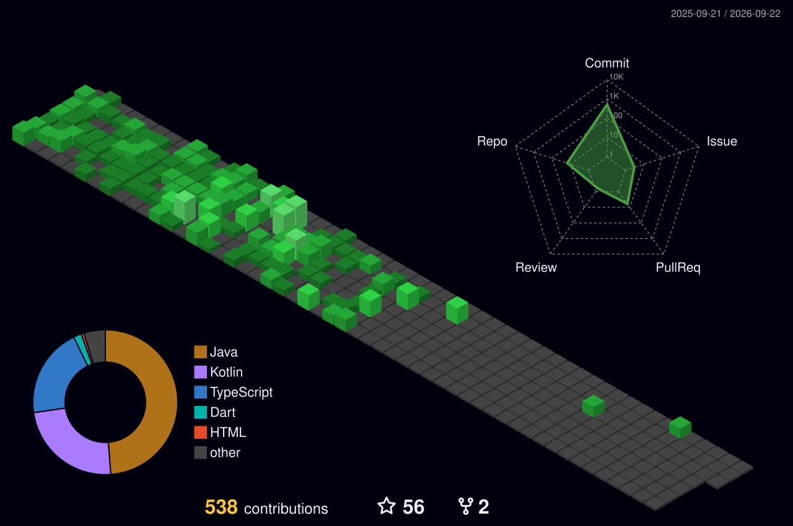

# 👋 Hey, I'm Pandi Harshan K

- 3rd-year B.E. Computer Science Engineering student with a specialization in Artificial Intelligence & Machine Learning  
- Core strengths include MERN Stack development, Data Science, and Competitive Programming  
- Currently deepening knowledge in System Design and applied Machine Learning concepts  
- Solved 1000+ algorithmic problems across LeetCode, Codeforces, and Codolio  
- Strong belief in consistent learning through daily problem-solving  
- Interested in game development and the application of AI in interactive systems  

---

##  Tech Stack  

  <strong>Languages & Frameworks:</strong>
  
  
  
  
  
  

  <strong>Databases & Tools:</strong>
  
  
  
  

---

##  Connect With Me  

  
  
  

---

##  GitHub Activity & Impact

  

  

Consistent contributions • Long-term discipline

---
#  Competitive Programming Stats

<table>
<tr>

<!-- ================= LEETCODE ================= -->
<td width="33%" valign="top">

###  LeetCode

  

</td>

<!-- ================= CODECHEF ================= -->
<td width="33%" valign="top">

### CodeChef

<table align="center">
  <tr>
    <td colspan="2" align="center">
      
    </td>
  </tr>
  <tr>
    <td align="center">
      
    </td>
    <td align="center">
      
    </td>
  </tr>
  <tr>
    <td align="center">
      
    </td>
    <td align="center">
      
    </td>
  </tr>
  <tr>
    <td align="center">
      
    </td>
    <td align="center">
      
    </td>
  </tr>
  <tr>
    <td colspan="2" align="center">
      
    </td>
  </tr>
</table>

 

</td>

<!-- ================= CODEFORCES ================= -->
<td width="33%" valign="top">

###  Codeforces

  

</td>

</tr>
</table>

---

## Projects

### Campus Bus Buddy
A smart mobile application designed to digitalize college bus transportation through real-time tracking and attendance management.  
Built with a role-based architecture (Admin, Driver, Student) to ensure secure access, efficient monitoring, and smooth coordination.  
Powered by Firebase Authentication and Firestore for secure login, real-time data synchronization, and a serverless backend.  
Focused on solving real-world campus transportation challenges such as live bus tracking, QR-based attendance, absence planning, and centralized monitoring.  
Designed with a modern, premium UI to deliver a clean, intuitive, and professional user experience.  
https://github.com/Pandiharshan/bus_alert_system  

---

### Meet Mogger AI
An AI-driven system focused on intelligent interaction and contextual response handling.  
Designed with a modular architecture to support experimentation with machine learning and natural language processing techniques.  
Built with a strong emphasis on clean design, extensibility, and practical AI problem solving.  
https://github.com/Pandiharshan/MeetMogger-AI  

---

### Smart Desk Assistant
An Android application for monitoring and managing desk lighting conditions in real time.  
Built using Kotlin, Jetpack Compose, and AndroidX, following modern Android development best practices.  
Supports environment-aware behavior with customizable alerts and intelligent controls for improved workspace efficiency.  
https://github.com/Pandiharshan/Smart-Desk-Assistant  

---

### Snowman
An interactive learning platform focused on structured skill progression and consistent user engagement.  
Designed with a strong emphasis on user experience, performance, and scalable frontend architecture.  
Encourages disciplined learning through intuitive workflows, modular content structure, and progress-oriented design.  
https://github.com/Pandiharshan/Snowman  

---

## Dev Quotes  

  

